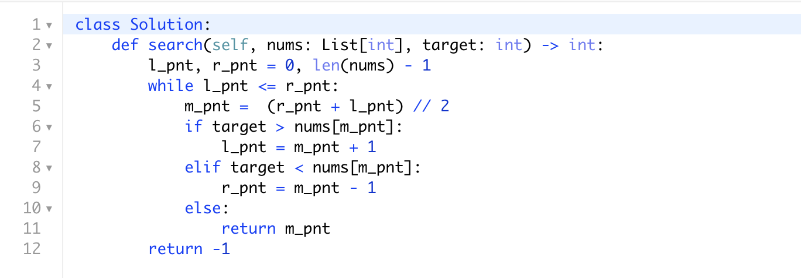

# Binary Search

Given an array of integers `nums` which is sorted in ascending order, and an integer `target`, write a function to search `target` in `nums`. 
If `target` exists, then return its index. Otherwise, return `-1`.

You must write an algorithm with `O(log n)` runtime complexity.


### Example 1:
```
Input: nums = [-1,0,3,5,9,12], target = 9
Output: 4
Explanation: 9 exists in nums and its index is 4
```

### Example 2:
```
Input: nums = [-1,0,3,5,9,12], target = 2
Output: -1
Explanation: 2 does not exist in nums so return -1
```

### Constraints:
- `1 <= nums.length <= 104`
- `-104 < nums[i], target < 104`
- All the integers in `nums` are **unique**.
- `nums` is sorted in ascending order.

## 解法思路：

### Binary Search

（1）找中间数，将目标数和中间数比较

（2）目标数大于中间数，看右边大的一半；目标数小于中间数，看左边小的一半；目标数等于中间数，就找到了

#### 复杂度： 

## 代码：


